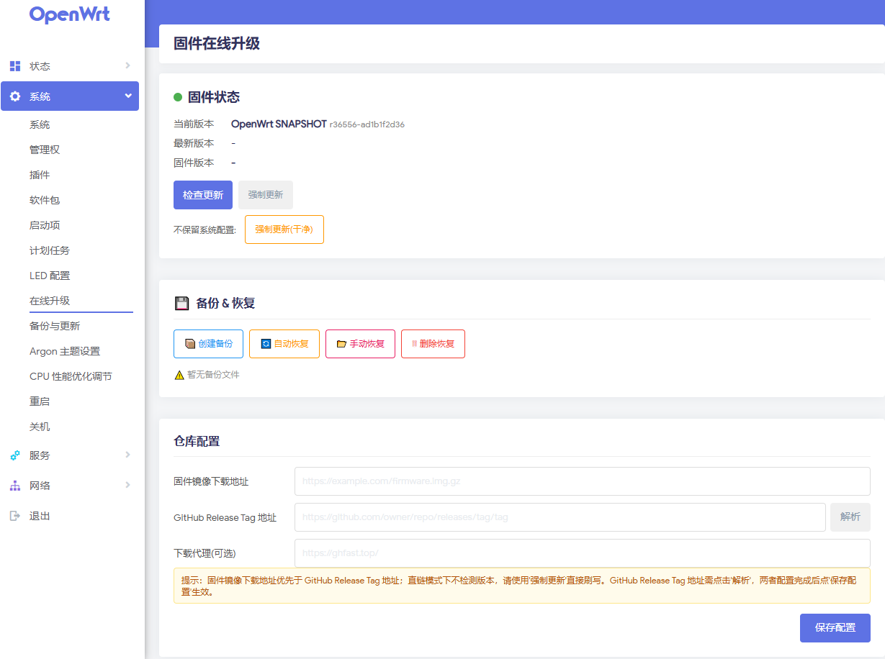

# luci-app-online-upgrade

[中文](README.md) | **English**

ImmortalWrt / OpenWrt LuCI plugin - Online firmware upgrade from GitHub Releases.



## Features

- **Dual firmware source modes**: Supports GitHub Release Tag URL auto-parsing and direct firmware image download URL input, with the firmware image download URL taking priority
- **Smart detection & upgrade**: Automatically detects firmware updates, one-click online upgrade; supports keep-config upgrade and clean upgrade keeping only this plugin
- **Download acceleration**: Supports GitHub download acceleration proxy, customizable proxy address for faster and more stable downloads
- **Safe backup**: Automatically backs up configuration to `/root/pre-upgrade-backup-*.tar.gz` before upgrade and restores after flashing; manual backup, download, restore and delete functions provided
- **Force update**: Force re-download and flash even when already on the latest version
- **System adaptive**: Automatically identifies ImmortalWrt / OpenWrt runtime and detects router architecture to match corresponding firmware
- **Multi-format compatibility**: Compatible with `.img.gz` / `.img` / `.itb` (ARM64 etc.) / `.bin` and other firmware formats
- **SNAPSHOT support**: Supports SNAPSHOT firmware, uses revision number `r36350` to determine newness, falls back to compile timestamp when revision is absent
- **Multi package formats**: Compiles both `.ipk` (opkg) and `.apk` (apk) formats, compatible with OpenWrt 23.05 and earlier and 25.12+

## Usage

1. After installation, open **System → Online Upgrade** in LuCI
2. **Firmware source config**: Choose one
   - Paste GitHub Release Tag URL and click **Parse** to auto-fill repo and tag
   - Or input the firmware image download URL directly, which takes priority over the GitHub Release Tag URL
   - Optionally set download proxy to accelerate GitHub downloads
3. Click **Save Configuration**
4. Click **Check Update** to view latest firmware
5. Click **Upgrade Now** or **Force Update** to start, supports keep/clean modes
6. Router will automatically backup config → download firmware → flash → reboot

## Build

```bash
# Put this plugin into openwrt/package/luci-app-online-upgrade/
cd openwrt
make package/luci-app-online-upgrade/compile V=s
```

## Manual Install

**opkg (OpenWrt/ImmortalWrt 23.05 and earlier):**
```bash
opkg install luci-app-online-upgrade_1.1.1_all.ipk
```

**apk (OpenWrt/ImmortalWrt 25.12+):**
```bash
apk add --allow-untrusted luci-app-online-upgrade-1.1.1-r4.apk
```

## Dependencies

- curl
- jsonfilter
- LuCI (luci-base)

## 🌟 Star

> **"A star from you brings more light to open source!"**

## 🎉 Thanks

- [gooyjq/luci-app-online-upgrade](https://github.com/gooyjq/luci-app-online-upgrade)

This project is forked from gooyjq/luci-app-online-upgrade and further developed, thanks to the original author for their hard work!
