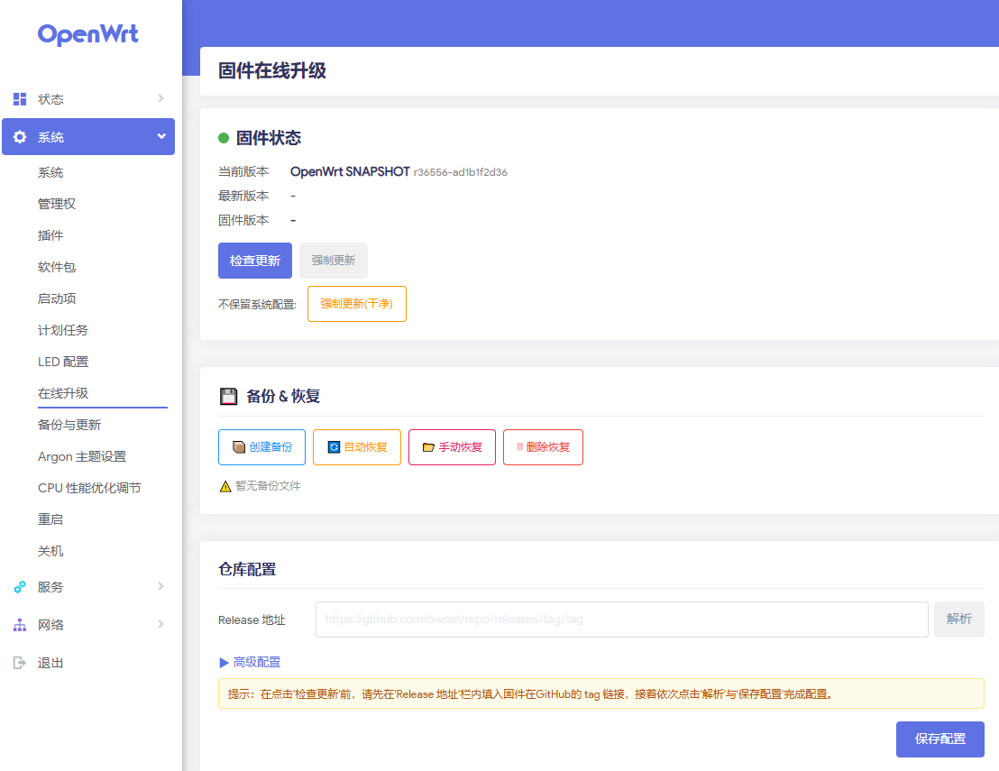

# luci-app-online-upgrade

ImmortalWrt / OpenWrt LuCI 插件 - 从 GitHub Releases 在线升级固件。

本项目基于 [gooyjq/luci-app-online-upgrade](https://github.com/gooyjq/luci-app-online-upgrade) 克隆而来，在此基础上做了大量优化与增强，特此感谢原仓库的辛勤付出。



## 功能

- 支持自定义 GitHub 仓库、Release 标签
- 自动检测固件更新
- 一键在线升级，保留系统配置
- 支持 GitHub 下载加速代理
- 升级前自动备份配置到 boot 分区
- 强制更新：即使已是最新版本也可重新刷写
- 自动识别运行系统（ImmortalWrt / OpenWrt）并适配默认配置
- 自动检测路由器架构匹配固件文件
- 兼容多种固件格式：`.img.gz` / `.img` / `.itb`（ARM64 等）/ `.bin`
- 支持 SNAPSHOT 快照固件：用修订号（`r36350`）判断新旧，文件名无修订号时回退到编译时间戳
- 同时编译 .ipk (opkg) 和 .apk (apk) 两种格式

## 使用方法

1. 安装后，在 LuCI 菜单 **系统 → 在线升级** 进入
2. 粘贴 Release 地址自动解析，或手动配置仓库和标签
3. 点击 **检查更新** 查看最新固件
4. 点击 **立即升级** 或 **强制更新** 开始升级
5. 路由器将自动备份配置 → 下载固件 → 刷写 → 重启

## 编译

```bash
# 将本插件放到 openwrt/package/luci-app-online-upgrade/
cd openwrt
make package/luci-app-online-upgrade/compile V=s
```

## 手动安装

**opkg (OpenWrt/ImmortalWrt 23.05 及更早):**
```bash
opkg install luci-app-online-upgrade_1.0.7_all.ipk
```

**apk (OpenWrt/ImmortalWrt 25.12+):**
```bash
apk add --allow-untrusted luci-app-online-upgrade-1.0.7-r1.apk
```

## 依赖

- curl
- jsonfilter
- LuCI (luci-base)

## 配置

UCI 配置文件 `/etc/config/online-upgrade`：

```bash
config online-upgrade 'settings'
    option enabled '1'
    option repo 'owner/repo'          # GitHub 仓库，需自行填写，如 gooyjq/ImmortalWrt-Builder
    option tag 'tag'                  # Release 标签，需自行填写，如 Autobuild-x86-64
    option proxy 'https://ghfast.top/'
    option firmware_pattern 'auto'   # 留空或 auto 自动匹配；也可填正则
    option keep_config '1'
```

## 许可证

GNU GENERAL PUBLIC LICENSE
